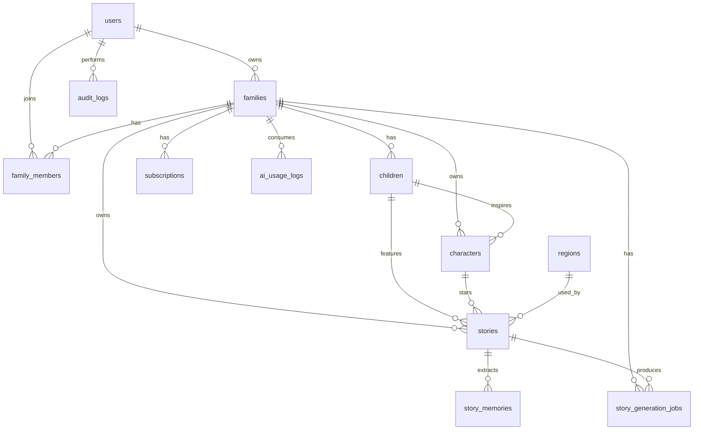

# ERD 資料庫設計

## ERD

## 資料表規格

### users

| 欄位 | 型別 | 說明 |
|---|---|---|
| id | BIGINT PK | 使用者 ID |
| email | VARCHAR(255) UNIQUE | 登入 email |
| password_hash | VARCHAR(255) | 密碼雜湊 |
| display_name | VARCHAR(100) | 顯示名稱 |
| created_at / updated_at / deleted_at | DATETIME | 時間欄位 |

### families

| 欄位 | 型別 | 說明 |
|---|---|---|
| id | BIGINT PK | 家庭 ID |
| owner_user_id | BIGINT FK | 擁有者 |
| name | VARCHAR(100) | 家庭名稱 |
| plan_type | VARCHAR(50) | free/premium/family |
| created_at / updated_at / deleted_at | DATETIME | 時間欄位 |

### family_members

| 欄位 | 型別 | 說明 |
|---|---|---|
| id | BIGINT PK | 成員 ID |
| family_id | BIGINT FK | 家庭 |
| user_id | BIGINT FK | 使用者 |
| role | VARCHAR(50) | owner/admin/member/viewer |
| status | VARCHAR(50) | active/invited/removed |
| joined_at | DATETIME | 加入時間 |

### children

| 欄位 | 型別 | 說明 |
|---|---|---|
| id | BIGINT PK | 孩子 ID |
| family_id | BIGINT FK | 家庭 |
| name | VARCHAR(100) | 名字 |
| nickname | VARCHAR(100) | 暱稱 |
| birth_date | DATE | 生日 |
| gender_optional | VARCHAR(50) NULL | 選填性別 |
| avatar_url | VARCHAR(500) NULL | 頭像 |
| created_at / updated_at / deleted_at | DATETIME | 時間欄位 |

### characters

| 欄位 | 型別 | 說明 |
|---|---|---|
| id | BIGINT PK | 角色 ID |
| family_id | BIGINT FK | 家庭 |
| child_id | BIGINT FK | 對應孩子 |
| real_name | VARCHAR(100) | 真實名字 |
| story_name | VARCHAR(100) | 童話名字 |
| role_type | VARCHAR(100) | 角色職業 |
| personality_traits | JSON | 個性 |
| likes | JSON | 喜歡 |
| fears | JSON | 害怕 |
| magic_power | VARCHAR(255) | 魔法能力 |
| avatar_url | VARCHAR(500) NULL | 角色圖 |
| level / exp | INT | 成長欄位 |

### regions

| 欄位 | 型別 | 說明 |
|---|---|---|
| id | BIGINT PK | 區域 ID |
| name | VARCHAR(100) | 區域名稱 |
| description | TEXT | 描述 |
| theme | VARCHAR(100) | 主題 |
| unlock_level | INT | 解鎖等級 |
| sort_order | INT | 排序 |
| is_active | BOOLEAN | 是否啟用 |

### stories

| 欄位 | 型別 | 說明 |
|---|---|---|
| id | BIGINT PK | 故事 ID |
| family_id / child_id / main_character_id / region_id | BIGINT FK | 關聯 |
| title | VARCHAR(255) | 標題 |
| summary | TEXT | 摘要 |
| content | LONGTEXT | 內容 |
| theme | VARCHAR(100) | 主題 |
| story_length | VARCHAR(50) | 3_min/5_min/10_min |
| real_life_event | TEXT NULL | 真實事件 |
| tone | VARCHAR(50) | 語氣 |
| language | VARCHAR(20) | zh-TW |
| ai_provider / ai_model | VARCHAR(100) | AI 資訊 |
| status | VARCHAR(50) | draft/published/blocked/deleted |
| safety_check | JSON | 安全檢查結果 |

### story_memories

| 欄位 | 型別 | 說明 |
|---|---|---|
| id | BIGINT PK | 記憶 ID |
| family_id / child_id / story_id | BIGINT FK | 關聯 |
| tag | VARCHAR(100) | 記憶標籤 |
| memory_type | VARCHAR(50) | event/trait/theme/region |
| importance_score | INT | 重要性 |
| created_at | DATETIME | 建立時間 |

### story_generation_jobs

| 欄位 | 型別 | 說明 |
|---|---|---|
| id | BIGINT PK | 任務 ID |
| family_id | BIGINT FK | 家庭 |
| requested_by_user_id | BIGINT FK | 發起人 |
| story_id | BIGINT NULL | 成功後關聯故事 |
| status | VARCHAR(50) | pending/processing/completed/failed/blocked |
| request_payload | JSON | 請求快照 |
| ai_response_payload | JSON NULL | AI 回應 |
| error_message | TEXT NULL | 錯誤 |
| started_at / finished_at | DATETIME | 任務時間 |

### subscriptions / ai_usage_logs / audit_logs

保留付費、用量與稽核基礎，MVP 可先不串金流。

## 索引策略

- `users.email` unique。
- `family_members(family_id, user_id)` unique。
- `children(family_id, deleted_at)`。
- `characters(family_id, child_id, deleted_at)`。
- `stories(family_id, created_at)`、`stories(child_id, created_at)`、`stories(theme)`。
- `story_memories(family_id, child_id, created_at)`、`story_memories(tag)`。
- `story_generation_jobs(family_id, status, created_at)`。
- `audit_logs(family_id, created_at)`。
