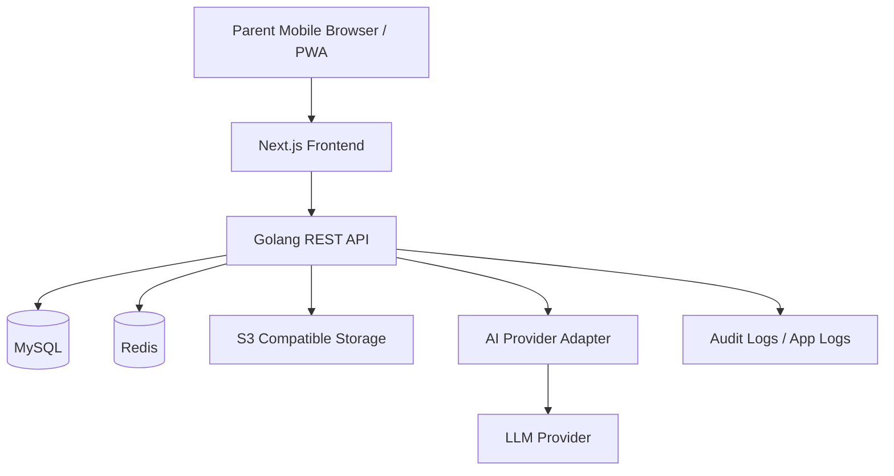
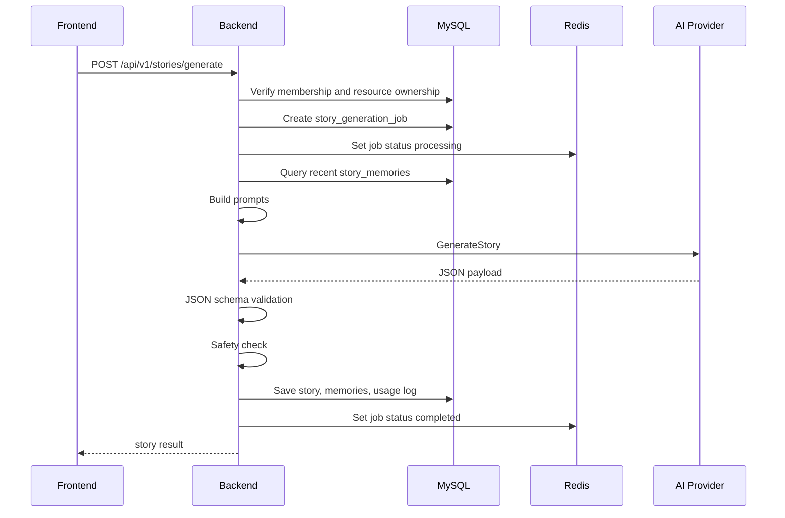

# 系統架構設計

## 技術選型

| 層級 | 技術 | 用途 |
|---|---|---|
| Frontend | Next.js / React / TypeScript / Tailwind CSS | H5/PWA 手機優先介面 |
| Backend | Golang / Gin | REST API 與商業邏輯 |
| Database | MySQL 8 | 核心資料保存 |
| Cache | Redis | Rate limit、JWT blacklist、AI job status |
| Storage | S3 Compatible Storage | 頭像、插圖、未來 PDF/音檔 |
| AI | Provider Adapter | OpenAI 或其他供應商抽象化 |
| Deployment | Docker Compose | MVP Cloud VM 部署 |

## High-level Architecture

## Backend Clean Architecture

- Domain Layer：User、Family、Child、Character、Region、Story、Subscription entities 與 domain rules。
- Application Layer：Use cases，例如 RegisterUser、CreateChild、GenerateStory、GetTimebook。
- Infrastructure Layer：MySQL repository、Redis client、AI provider、S3 storage。
- Interface Layer：HTTP handlers、middlewares、routes、request/response DTO。

## 模組邊界

| 模組 | 職責 |
|---|---|
| Auth | 註冊、登入、JWT、logout blacklist |
| Family | 家庭、成員、角色權限 |
| Child | 孩子資料與隱私欄位 |
| Character | 童話角色與角色成長欄位 |
| Region | 預設王國地圖 |
| Story | 故事生成、保存、讀取、刪除 |
| Memory | memory_tags 儲存與檢索 |
| AI | prompt 組裝、provider interface、安全檢查 |
| Subscription | plan_type、quota、usage |
| Audit | 重要操作追蹤 |

## 故事生成資料流

## 非功能設計

- Rate limit：依 user_id/family_id/IP 限制故事生成頻率。
- Timeout：AI 呼叫設定 timeout，失敗寫入 job error_message。
- Retry：只對 transient error 重試，避免重複扣額度。
- Observability：所有 AI job 需有 request id、status、duration、provider、model。
- Data isolation：所有 family-scoped table 查詢必須帶 family_id。
