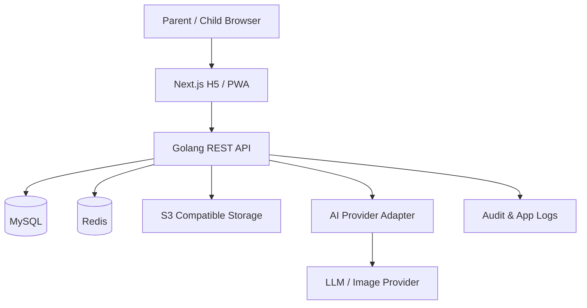
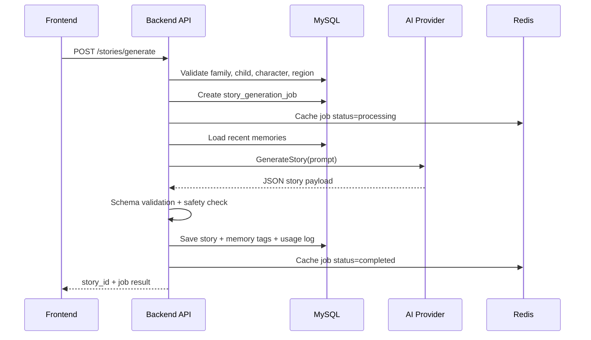
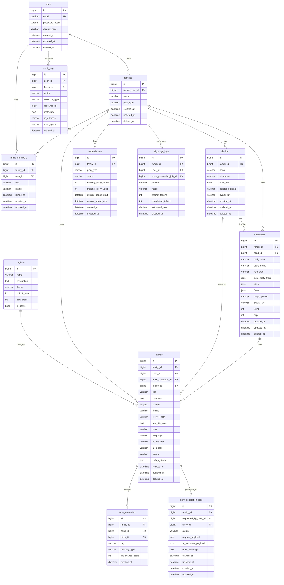

# 童話城堡 Fairy Castle：PRD、MVP、架構與 API 規格

> 版本：v0.1  
> 日期：2026-06-13  
> 階段：第一階段產品與系統設計，不包含程式碼實作。

## 1. 完整 PRD

### 1.1 產品願景

「童話城堡 Fairy Castle」是一座陪伴孩子長大的家庭童話王國。它不是單次 AI 故事產生器，而是以家庭、孩子、角色、生活事件與故事記憶為核心的 Family Story Universe。

產品販售的核心價值不是 AI 本身，而是親子陪伴、家庭回憶、成長紀錄與情感保存。

### 1.2 產品目標

1. 讓父母能在 3 分鐘內產生一篇可朗讀、適齡且溫柔的睡前故事。
2. 將孩子真實生活事件轉化為童話冒險並永久保存。
3. 建立可持續成長的角色、世界地圖與故事記憶。
4. 讓家庭能用時光書回顧孩子成長歷程。
5. 為後續訂閱、年度童話書、AI 插圖與語音朗讀建立基礎。

### 1.3 目標使用者與 Persona

#### Persona A：新手爸爸 Kevin

- 年齡：35 歲。
- 孩子：4 歲女兒。
- 痛點：睡前故事常常想不到新內容，工作後精力有限。
- 需求：快速產生溫柔、有教育意義、可以直接唸的故事。

#### Persona B：重視陪伴的媽媽 Emma

- 年齡：32 歲。
- 孩子：6 歲兒子。
- 痛點：希望記錄孩子成長，但不想寫長篇日記。
- 需求：把生活事件轉成有紀念價值的故事。

#### Persona C：遠距阿嬤 Mei

- 年齡：62 歲。
- 孫子：5 歲。
- 痛點：不常見面，但想參與孩子成長。
- 需求：未來可共同創作或留言，MVP 先保留家族版資料模型。

### 1.4 使用者痛點

1. 父母缺乏故事靈感。
2. 一般故事內容不夠個人化。
3. 成長記錄分散在相簿、聊天紀錄與社群平台中。
4. 兒童內容安全與適齡性難以控管。
5. 家庭回憶缺乏長期整理與回顧機制。

### 1.5 核心使用流程

1. 使用者註冊或登入。
2. 建立家庭。
3. 建立孩子資料。
4. 建立童話角色。
5. 選擇孩子、角色、場景、主題、長度與語氣。
6. 可選填真實生活事件。
7. 系統建立故事生成任務並呼叫 AI。
8. 系統驗證 AI JSON、執行內容安全檢查並儲存故事。
9. 使用者進入故事閱讀頁。
10. 故事自動歸檔到時光書。

### 1.6 MVP 成功指標

- 註冊到產生第一篇故事完成率 >= 50%。
- 第一篇故事產生平均時間 <= 60 秒。
- AI JSON 合法率 >= 95%。
- 故事安全檢查通過率 >= 98%。
- 使用者 7 日內再次產生故事比例 >= 25%。
- 核心 API P95 回應時間：非 AI API <= 500ms，AI 任務建立 <= 1s。

### 1.7 商業模式規劃

| 方案 | 目標 | MVP 處理方式 |
|---|---|---|
| Free | 降低體驗門檻 | 實作 plan_type 與 quota 欄位，限制可後續啟用 |
| Premium | 個人家庭付費 | 先建資料模型，不串金流 |
| Family | 多家人共同創作 | 先建 family_members 權限模型 |
| 年度童話書 | 高情感價值商品 | MVP 先支援時光書，PDF/實體書延後 |
| AI 聲音朗讀 | V2/V3 加值 | MVP 不做 |

## 2. MVP 功能清單

### 2.1 必做功能

| 模組 | 功能 | 優先級 |
|---|---|---|
| Auth | 註冊、登入、登出、JWT 驗證、取得自己資料 | P0 |
| Family | 建立家庭、取得我的家庭、更新家庭名稱 | P0 |
| Children | 新增、列表、詳情、更新、刪除孩子 | P0 |
| Characters | 新增、列表、詳情、更新、刪除童話角色 | P0 |
| Regions | 預設 8 個王國區域 | P0 |
| Stories | 建立生成任務、AI 生成、儲存、列表、詳情 | P0 |
| Timebook | 依年月分組、依條件篩選 | P0 |
| Subscription | 方案欄位與用量紀錄 | P1 |
| Admin | 基礎故事與 AI 用量檢視 | P1 |
| Audit | 重要操作紀錄 | P1 |

### 2.2 MVP 不做

AI 語音、聲音複製、多人即時共創、社群分享、實體書下單、原生 App、複雜成就、即時聊天室、3D 城堡、向量資料庫。

## 3. User Stories

| 編號 | 角色 | User Story | 優先級 |
|---|---|---|---|
| US-001 | 父母 | 我想註冊帳號，方便保存家庭故事。 | P0 |
| US-002 | 父母 | 我想登入帳號，繼續管理孩子與故事。 | P0 |
| US-003 | 父母 | 我想建立家庭，讓資料集中在同一個童話王國。 | P0 |
| US-004 | 父母 | 我想建立孩子資料，讓故事能符合孩子年齡與喜好。 | P0 |
| US-005 | 父母 | 我想建立童話角色，讓孩子在故事裡有專屬身份。 | P0 |
| US-006 | 父母 | 我想選擇場景、主題、長度與語氣，控制故事方向。 | P0 |
| US-007 | 父母 | 我想輸入今天發生的事，把生活事件變成童話。 | P0 |
| US-008 | 父母 | 我想閱讀 AI 產生的故事，直接唸給孩子聽。 | P0 |
| US-009 | 父母 | 我想回看過去故事，整理孩子成長回憶。 | P0 |
| US-010 | 系統管理者 | 我想檢視 AI 用量與失敗任務，方便營運與除錯。 | P1 |

## 4. Acceptance Criteria

### 4.1 Auth

- Given 使用者輸入有效 email、密碼與顯示名稱，When 呼叫註冊 API，Then 系統建立使用者並回傳 JWT。
- Given 使用者輸入錯誤密碼，When 呼叫登入 API，Then 系統回傳 401。
- Given JWT 過期或無效，When 呼叫受保護 API，Then 系統回傳 401。

### 4.2 Family / Children / Characters

- 使用者只能存取自己所屬家庭資料。
- 孩子的 gender_optional 可為空。
- 童話角色必須屬於目前家庭，且 child_id 必須屬於同家庭。
- 刪除孩子或角色採軟刪除，避免破壞既有故事歷史。

### 4.3 Story Generation

- 建立故事時，child_id、main_character_id、region_id 必須屬於目前家庭或系統公開區域。
- 系統必須建立 story_generation_jobs 紀錄。
- AI 回傳必須是合法 JSON 且符合 schema。
- 若安全檢查失敗，故事不可發布為可閱讀狀態，任務標示 failed 或 blocked。
- 成功故事必須寫入 stories 與 story_memories。

### 4.4 Timebook

- 時光書預設依年份、月份、故事建立時間倒序顯示。
- 支援 child_id、character_id、theme、region_id、year 篩選。
- 不同家庭不可讀取彼此時光書。

## 5. 系統架構設計

### 5.1 技術選型

| 層級 | 技術 | 說明 |
|---|---|---|
| Frontend | Next.js + React + TypeScript + Tailwind CSS | 手機優先 H5/PWA |
| Backend | Golang + Gin | REST API 與 Clean Architecture |
| Database | MySQL 8 | 核心交易資料 |
| Cache | Redis | Rate limit、JWT blacklist、AI job 狀態快取 |
| Storage | S3 Compatible Storage | 頭像、插圖、未來 PDF/音檔 |
| AI | Provider Interface | OpenAI 或其他 Provider 可替換 |
| Deployment | Docker Compose | MVP 先以 Cloud VM 部署 |

### 5.2 架構圖



### 5.3 後端模組邊界

- Auth：註冊、登入、JWT、密碼雜湊。
- Family：家庭與成員權限。
- Child：孩子資料與隱私欄位。
- Character：童話角色與成長等級欄位。
- Region：王國地圖區域。
- Story：故事生成、保存、讀取、刪除。
- Memory：故事記憶標籤抽取與檢索。
- Subscription：方案、額度、用量。
- AI：Provider interface、prompt 組裝、schema 驗證、安全檢查。
- Audit：重要操作紀錄。

### 5.4 Story Generation Sequence



## 6. ERD 資料庫設計

### 6.1 ERD



### 6.2 索引策略

- users.email：唯一索引。
- family_members：family_id + user_id 唯一索引。
- children：family_id、family_id + deleted_at。
- characters：family_id、child_id、family_id + deleted_at。
- stories：family_id + created_at、child_id + created_at、main_character_id + created_at、region_id、theme。
- story_memories：family_id + child_id + created_at、tag。
- story_generation_jobs：family_id + status + created_at。
- ai_usage_logs：family_id + created_at。
- audit_logs：family_id + created_at、user_id + created_at。

## 7. REST API 規格

### 7.1 共通規則

- Base URL：`/api/v1`。
- Auth：`Authorization: Bearer <jwt>`。
- Content-Type：`application/json`。
- 錯誤格式：

```json
{
  "error": {
    "code": "VALIDATION_ERROR",
    "message": "欄位格式不正確",
    "details": {}
  }
}
```

### 7.2 Auth

#### POST /auth/register

Request:

```json
{
  "email": "parent@example.com",
  "password": "securePassword123",
  "display_name": "小雨爸爸"
}
```

Response 201:

```json
{
  "user": { "id": 1, "email": "parent@example.com", "display_name": "小雨爸爸" },
  "access_token": "jwt",
  "expires_in": 3600
}
```

#### POST /auth/login

Request:

```json
{
  "email": "parent@example.com",
  "password": "securePassword123"
}
```

#### POST /auth/logout

- 將 JWT jti 加入 Redis blacklist。

#### GET /auth/me

- 回傳目前使用者與家庭摘要。

### 7.3 Families

#### POST /families

```json
{
  "name": "小雨的童話城堡"
}
```

#### GET /families/me

- 回傳使用者目前所屬家庭清單與角色。

#### PATCH /families/{familyId}

```json
{
  "name": "新的家庭名稱"
}
```

### 7.4 Children

#### POST /children

```json
{
  "family_id": 1,
  "name": "小雨",
  "nickname": "雨雨",
  "birth_date": "2022-05-01",
  "gender_optional": null,
  "avatar_url": null
}
```

#### GET /children

Query：`family_id`。

#### GET /children/{childId}

#### PATCH /children/{childId}

#### DELETE /children/{childId}

- 軟刪除。

### 7.5 Characters

#### POST /characters

```json
{
  "family_id": 1,
  "child_id": 1,
  "real_name": "小雨",
  "story_name": "星光小魔女",
  "role_type": "月光魔法學徒",
  "personality_traits": ["好奇", "善良", "愛笑"],
  "likes": ["兔子", "草莓", "公主"],
  "fears": ["打雷", "黑暗"],
  "magic_power": "讓星星發出溫柔的光"
}
```

#### GET /characters

Query：`family_id`, `child_id`。

#### GET /characters/{characterId}

#### PATCH /characters/{characterId}

#### DELETE /characters/{characterId}

### 7.6 Regions

#### GET /regions

Response:

```json
{
  "items": [
    { "id": 1, "name": "童話城堡", "theme": "home", "unlock_level": 1, "sort_order": 1 }
  ]
}
```

### 7.7 Stories

#### POST /stories/generate

Request:

```json
{
  "family_id": 1,
  "child_id": 1,
  "main_character_id": 1,
  "region_id": 2,
  "theme": "勇氣",
  "story_length": "5_min",
  "real_life_event_optional": "今天小雨第一次自己收玩具。",
  "tone": "睡前安撫",
  "language": "zh-TW"
}
```

Response 202 或 201:

```json
{
  "job_id": 1001,
  "status": "completed",
  "story": {
    "id": 501,
    "title": "星光小魔女的整理任務",
    "summary": "小雨在魔法森林學會把魔法石送回家。"
  }
}
```

#### GET /stories

Query：`family_id`, `child_id`, `character_id`, `theme`, `region_id`, `year`, `page`, `page_size`。

#### GET /stories/{storyId}

#### PATCH /stories/{storyId}

- MVP 僅允許更新 title、summary 或狀態；content 是否可編輯需記錄 audit log。

#### DELETE /stories/{storyId}

- 軟刪除。

### 7.8 Timebook

#### GET /timebook

Query：`family_id`, `child_id`, `character_id`, `theme`, `region_id`, `year`。

Response:

```json
{
  "years": [
    {
      "year": 2026,
      "months": [
        {
          "month": 6,
          "stories": [
            { "id": 501, "title": "勇敢的星光小魔女", "created_at": "2026-06-13T20:00:00Z" }
          ]
        }
      ]
    }
  ]
}
```

#### GET /timebook/{year}

- 回傳特定年份分組資料。

## 8. AI Story Engine 規格

### 8.1 Pipeline

1. Request Validation：驗證 family、child、character、region 與 quota。
2. Memory Retrieval：抓取最近且相關的 5 到 10 筆 story_memories。
3. Prompt Assembly：組裝 system prompt 與 user prompt。
4. AI Generation：呼叫 provider interface。
5. JSON Schema Validation：驗證 title、summary、content、memory_tags、safety_check。
6. Content Safety Check：檢查禁用內容、敏感字、年齡適配與 prompt injection。
7. Persistence：儲存 story、job、memory tags、usage log。
8. Response：回傳 story_id 或 job status。

### 8.2 AIService Interface

```text
GenerateStory(ctx, StoryGenerationInput) -> StoryGenerationOutput
GenerateImage(ctx, ImageGenerationInput) -> ImageGenerationOutput // V2
GenerateSummary(ctx, SummaryInput) -> SummaryOutput
ExtractMemoryTags(ctx, StoryContent) -> []MemoryTag
SafetyCheck(ctx, StoryContent) -> SafetyCheckResult
```

### 8.3 Story JSON Schema

```json
{
  "title": "string",
  "summary": "string",
  "age_range": "string",
  "theme": "string",
  "region": "string",
  "main_character": "string",
  "content": "string",
  "moral": "string",
  "memory_tags": ["string"],
  "safety_check": {
    "violence": false,
    "death": false,
    "adult_content": false,
    "scary_content": false,
    "discrimination": false,
    "unsafe_behavior": false
  }
}
```

### 8.4 Safety Rules

- 禁止死亡、血腥、成人內容、歧視、仇恨、過度恐怖、真實自傷或危險模仿行為。
- 冒險可有小挑戰，但要低焦慮、可被照顧者引導。
- 睡前安撫語氣不可過度刺激。
- 真實事件需被溫柔轉化，不羞辱孩子。
- 不允許使用者 prompt 覆蓋系統安全規則。

### 8.5 Memory Retrieval MVP

- 優先取同 child_id 的最近記憶。
- 若 theme 或 region 相同，importance_score 加權。
- 最多放入 10 筆，避免 prompt 過長。
- V2 再加入 embedding 與 vector database。

## 9. Prompt Template

### 9.1 System Prompt

```text
你是一位專業兒童故事作家，擅長為 2～10 歲孩子創作溫柔、有想像力、具教育意義的童話故事。

你正在為一個名叫「童話城堡」的家庭故事宇宙創作故事。

你必須使用繁體中文與台灣自然用語。請避免中國大陸用語與不自然翻譯腔。

你的故事必須適合兒童，避免以下內容：死亡、血腥、暴力、恐怖、成人內容、歧視、仇恨、過度驚嚇、過度焦慮、不適合兒童的暗示、危險模仿行為。

故事要溫暖、清楚、有畫面感，適合父母唸給孩子聽。可以有小小挑戰，但最後必須有安全、溫柔、安定的結尾。

如果使用者輸入包含不適合兒童的內容，請將其轉化為安全、溫和、適齡的情節，不要直接重複危險內容。

請只輸出合法 JSON，不要輸出 Markdown，不要輸出額外說明。
```

### 9.2 User Prompt Template

```text
請根據以下資訊生成一篇童話故事。

孩子資料：
- 名字：{{child_name}}
- 年齡：{{child_age}}
- 喜歡：{{child_likes}}
- 害怕：{{child_fears}}

主角資料：
- 童話名字：{{character_story_name}}
- 角色類型：{{character_role_type}}
- 個性：{{personality_traits}}
- 魔法能力：{{magic_power}}

故事設定：
- 場景：{{region_name}}
- 主題：{{theme}}
- 長度：{{story_length_label}}，約 {{target_word_count}} 字
- 語氣：{{tone}}
- 語言：繁體中文 zh-TW

真實事件：
{{real_life_event_optional_or_empty}}

過去記憶：
{{story_memories_or_empty}}

請輸出以下 JSON 欄位：
{
  "title": "故事標題",
  "summary": "一句話摘要",
  "age_range": "適合年齡，例如 3-6",
  "theme": "{{theme}}",
  "region": "{{region_name}}",
  "main_character": "{{character_story_name}}",
  "content": "完整故事內容",
  "moral": "故事寓意，用溫柔不說教的方式表達",
  "memory_tags": ["3 到 8 個可保存的記憶標籤"],
  "safety_check": {
    "violence": false,
    "death": false,
    "adult_content": false,
    "scary_content": false,
    "discrimination": false,
    "unsafe_behavior": false
  }
}
```

## 10. QA Test Plan

### 10.1 測試範圍

- Backend API：Auth、Family、Children、Characters、Regions、Stories、Timebook。
- Frontend E2E：註冊登入、建立孩子、建立角色、產生故事、閱讀故事、時光書。
- AI Quality：JSON、繁中台灣用語、內容安全、年齡適配、memory_tags。
- Security：權限隔離、JWT、SQL Injection、XSS、Rate limit、Prompt Injection。

### 10.2 測試工具

| 類型 | 工具 |
|---|---|
| Unit Test | Go test、React Testing Library |
| API Test | Postman/Newman 或 Go integration test |
| E2E | Playwright |
| Load Test | k6 |
| Security Smoke | OWASP ZAP |
| AI Eval | JSON schema validator + rule-based safety checks |

### 10.3 核心測試案例

#### Auth

- 註冊成功。
- 重複 email 註冊失敗。
- 登入成功。
- 密碼錯誤登入失敗。
- 無 JWT 呼叫受保護 API 失敗。

#### Family Isolation

- A 家庭不能讀取 B 家庭孩子。
- A 家庭不能用 B 家庭角色生成故事。
- A 家庭不能讀取 B 家庭時光書。

#### Story Generation

- 合法輸入可產生故事。
- AI 回傳非法 JSON 時 job 標示 failed。
- AI safety_check 不通過時故事不可讀。
- 成功故事會建立 memory_tags。
- 故事可於列表、詳情與時光書讀取。

#### AI Quality

- 必須是繁體中文。
- 不包含死亡、血腥、成人內容。
- 睡前安撫不應過度刺激。
- 有明確結尾與寓意。
- memory_tags 為 3 到 8 個。

### 10.4 UAT Checklist

- 父母可在手機完成註冊到產生第一篇故事。
- 故事可直接朗讀，段落清楚。
- 時光書能按年月回顧。
- 錯誤訊息對非技術使用者友善。
- Docker 環境可依 README 啟動。

## 11. Sprint Backlog

### Sprint 0：專案初始化

- 決定 monorepo 結構。
- 建立 backend / frontend / docs 目錄。
- 建立 Docker Compose：MySQL、Redis、backend、frontend。
- 設計 env.example。
- 建立 README 開發說明。
- 建立 OpenAPI 文件骨架。

### Sprint 1：使用者與家庭

- Backend：Auth register/login/logout/me。
- Backend：JWT middleware。
- Backend：families 與 family_members。
- Backend：children CRUD。
- Frontend：註冊、登入、Dashboard、建立孩子。
- QA：Auth 與 Children API 測試。

### Sprint 2：角色與地圖

- Backend：characters CRUD。
- Backend：regions seed 與 GET API。
- Frontend：建立角色、角色列表、王國地圖。
- QA：角色權限隔離測試。

### Sprint 3：故事生成

- Backend：AI provider interface。
- Backend：story_generation_jobs。
- Backend：prompt assembly、schema validation、safety check。
- Backend：stories 與 story_memories 寫入。
- Frontend：故事生成表單與 Loading 頁。
- QA：AI mock 測試與失敗流程測試。

### Sprint 4：故事閱讀與時光書

- Backend：stories list/detail/update/delete。
- Backend：timebook grouping API。
- Frontend：故事閱讀頁、故事列表、時光書頁、篩選。
- QA：E2E happy path。

### Sprint 5：QA、修正、部署

- 補齊 API regression test。
- Playwright E2E。
- k6 smoke load test。
- OWASP ZAP baseline。
- Docker 部署文件。
- MVP 上線前驗收與風險清單。

## 12. Repo 結構建議

建議使用 monorepo，原因是 MVP 階段前後端、API schema、Docker 與文件需要快速協作。

```text
/
  README.md
  docs/
    fairy-castle-mvp-planning.md
    api.openapi.yaml
    erd.md
    qa-test-plan.md
  backend/
    cmd/
      api/
        main.go
    internal/
      config/
      domain/
        user/
        family/
        child/
        character/
        story/
        region/
        subscription/
      application/
        services/
      infrastructure/
        db/
        redis/
        ai/
        storage/
      interfaces/
        http/
          handlers/
          middlewares/
          routes/
    pkg/
      logger/
      errors/
      validator/
    migrations/
    docs/
    Dockerfile
    go.mod
  frontend/
    app/
    components/
    features/
    lib/
      api/
      auth/
    public/
    tests/
    package.json
    next.config.js
  deployments/
    docker-compose.yml
    nginx/
  scripts/
  .github/
    workflows/
```

## 13. 下一步建議

第一階段文件已定義 PRD、MVP、User Stories、驗收標準、系統架構、ERD、REST API、AI Story Engine、Prompt Template、QA Test Plan、Sprint Backlog 與 Repo 結構。下一步可進入 Sprint 0，建立專案骨架與開發環境，但在開始前應先確認：

1. Backend 框架採 Gin 或 Echo，預設建議 Gin。
2. DB 存取採 GORM 或 SQLC，預設建議 GORM 以加速 MVP。
3. AI Provider MVP 是否先以 OpenAI adapter + mock provider 併行。
4. 前端是否採 Next.js App Router，預設建議採用。
